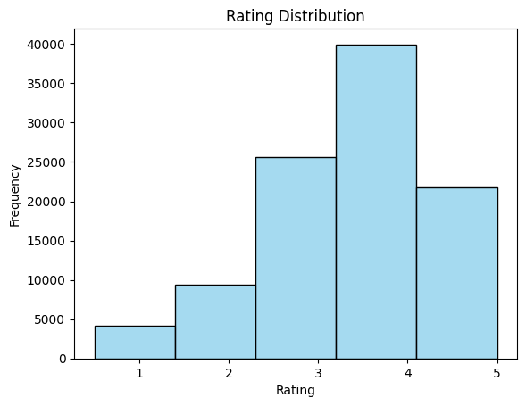
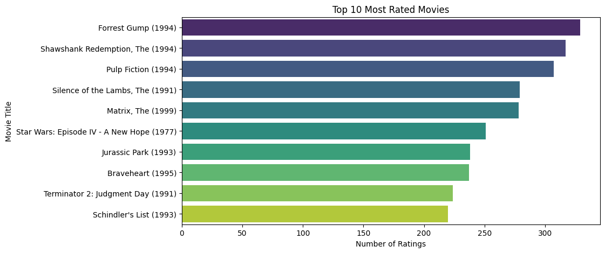

# Movie Recommendation System

This project implements a Movie Recommendation System using various data processing and machine learning techniques. The code is written in Python and uses libraries such as pandas, numpy, matplotlib, seaborn, and scikit-learn.

## Overview

The project starts by downloading and extracting a dataset of movies, users, and ratings. It then processes the data to build a recommendation system that can suggest movies based on user preferences.

## Steps

1. **Download and Extract Dataset**: The dataset is downloaded from the MovieLens website and extracted if it hasn't been downloaded before.
2. **Load Data**: The ratings and movies data are loaded into pandas DataFrames.
3. **Data Cleaning**: Check for missing or null values in the dataset.
4. **Merge Data**: Merge the ratings and movies DataFrames on the `movieId` column.
5. **Movie Statistics**: Calculate the average rating and number of ratings for each movie.
6. **Filter Movies**: Filter movies that have received 50 or more ratings.
7. **User-Movie Matrix**: Transform the DataFrame of user ratings into a matrix format.
8. **Dimensionality Reduction**: Use TruncatedSVD to reduce the dimensionality of the user-movie matrix.
9. **Movie Recommendations**: Compute movie similarities and recommend movies based on user input.
10. **Visualization**: Visualize the rating distribution and top-rated movies using matplotlib and seaborn.

## Usage

To run the project, execute the Jupyter Notebook file `Movie-Recommendation.ipynb`. The notebook contains all the necessary code and explanations for each step.

## Dependencies

- Python 3.12.8
- pandas
- numpy
- matplotlib
- seaborn
- scikit-learn
- requests

## Example

Here is an example of how to use the recommendation system:

```python
# Recommend movies similar to 'Toy Story (1995)'
print(recommend_movies("Toy Story (1995)", num_recommendations=5))
```

## Visualization

The project includes visualizations such as the rating distribution and the top 10 most rated movies.

### Rating Distribution



### Top 10 Most Rated Movies



## License

This project is licensed under the MIT License.